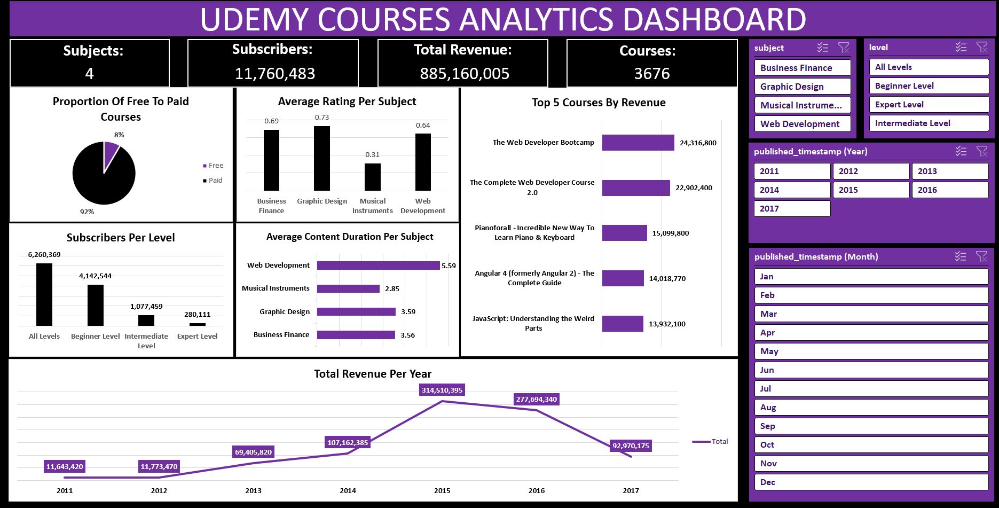

# Udemy-Data-Analytics-Project
I discovered this project online and conducted my own analysis based on it.

-[Project Link](https://www.datascienceportfol.io/users/NnaemekaOnyebueke/projects/1152-2)

## Project Overview & Business Problem
I work as a data analyst at Udemy, an educational technology company. My manager tasked me with analyzing course revenue data to identify ways to increase earnings and monitor course performance. Since Web Development courses are highly popular, she suggested considering a price increase and needs a report for the CEO in three weeks with ideas to boost next quarter's revenue.

### Tools Used:
I used Microsoft Excel, specifically the Power Query Editor, to clean the datasets effectively and create visual insights.

### Data Analysis and Insights:

- **Course Distribution:** Out of 3,676 courses, 3,365 (92%) are paid, while 311 (8%) are free.

- **Subject Ratings:** Graphic Design has the highest average rating (0.73), followed by Business Finance (0.69). Musical Instruments has the lowest average rating (0.31).

- **Content Duration:** Web Development courses have the highest average content duration (5.59 minutes), while Musical Instruments have the lowest (2.85 minutes).

- **Total Revenue:** Web Development generated the highest total revenue of $631,082,465, while Musical Instruments generated the lowest at $53,359,055.

- **Revenue:** Revenue steadily grew from $11,643,420 in 2011 to $314,510,395 in 2015. It then slightly declined to $277,694,340 in 2016, followed by a significant drop in 2017, with total revenue of $92,970,175.

- **Dashboard:**
